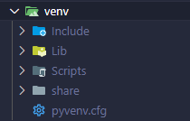
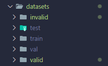

# ArnisScore

This repository contains the core project files. Due to large file size limitations, some folders (such as `venv`, `datasets`, and `models`) are **not included** in the GitHub repository. Please follow the instructions below to set up your environment and download the necessary resources.

---

## ✅ Install Virtual Environment

To isolate your project dependencies and ensure compatibility, it's recommended to use a virtual environment. Follow the steps below:

Make sure you have Python installed. Type "python -m venv venv" in terminal to install virtual environment. It will generate a folder like this:

This folder contains the project dependencies such as tensorflow, matplotlib, and etc.

## 📁 Download Dataset

Download the dataset manually from the link below:

📥 [Click here to download the dataset](https://drive.google.com/drive/folders/1CAuES_XsapAbSjg2op5Imr8i3q1P2rVJ)

After downloading, extract and place the dataset folder into the project root directory as shown:

